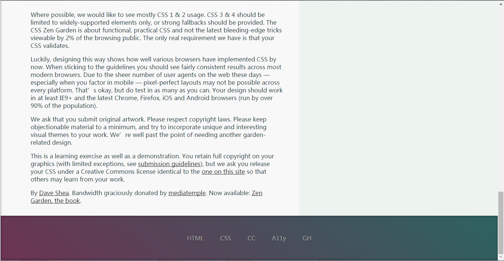

# warm-up
团队热身作品

##说明：
html目录下的html文档，是我们公用的html，暂时不进行改动。
我们要做的是在css目录下新建自己的css，然后通过改动css，设计并制作漂亮的页面。

这里使用的技术我们不做限制，可以用各种各样的css预编译工具。

我在这里配置了一个简单的gulp，添加了browsersync，less的相应功能。

package.json中我配置了browsersync，less，sass和gulp的安装，如果你也想使用这些工具，直接npm install就好了。
哦，对了，记得安装node环境哦。

###新任务：
请修改problem.less或者problem.css实现下图的效果：

